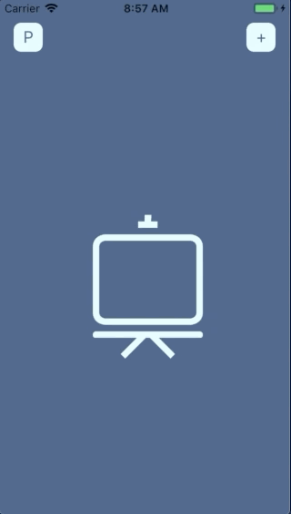
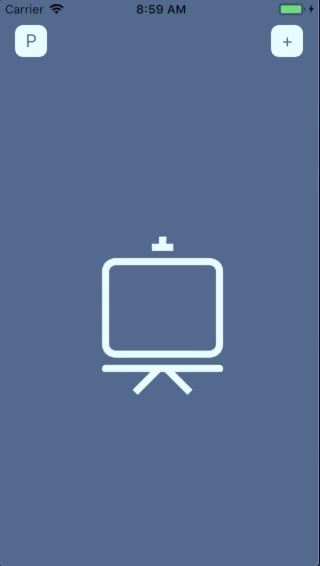
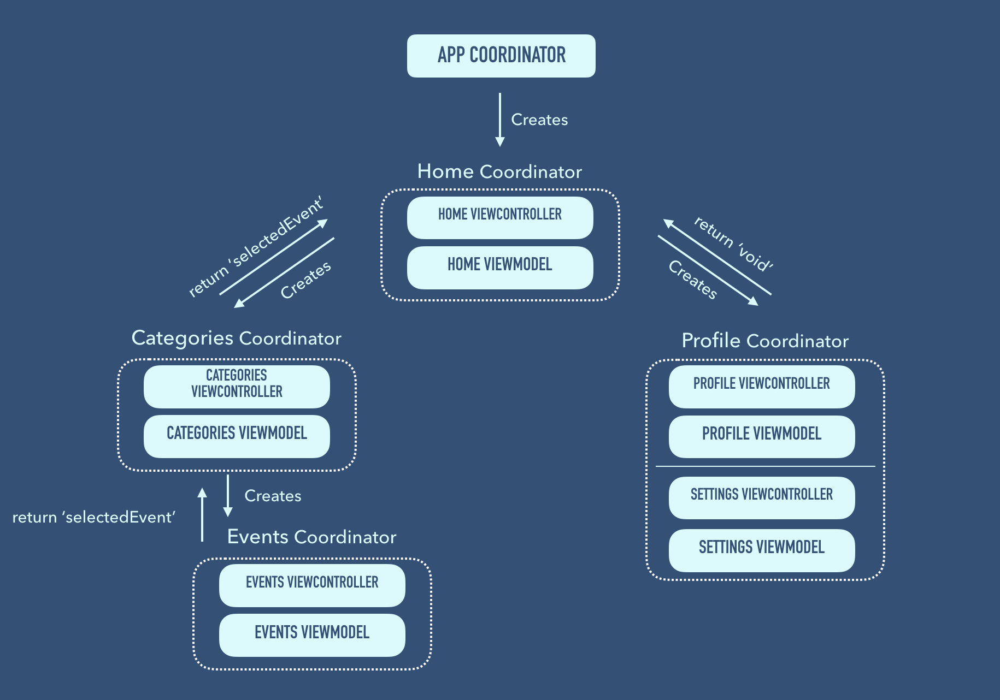

# Rx-MVVM-Coordinators example app

Example of architecture using RxSwift, MVVM and Coordinators

       

## Scheme

## Build with
* [RxSwift](https://github.com/ReactiveX/RxSwift) - Reactive framework
* [Moya](https://github.com/Moya/Moya) - Network abstraction layer
* [Hero](https://github.com/HeroTransitions/Hero) - Elegant transition library

## Contributing
Pull requests are welcome. For major changes, please open an issue first to discuss what you would like to change.
